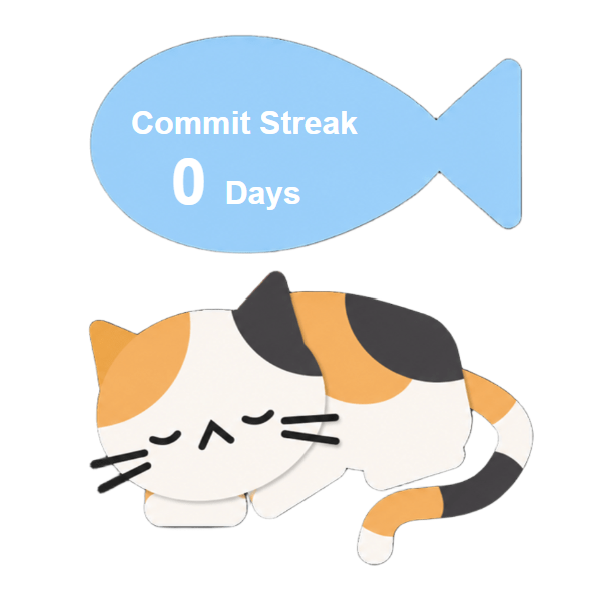

# 🐱 GitHub Cat Widget

A cute dynamic GitHub README widget built with Next.js, GitHub GraphQL API, and SVG.

## ✨ Features

- 💤 Dynamic GitHub contribution streak with 'Sleeping cat🐈' when your contribution streak is 0
- 🎨 SVG widget generated from your latest GitHub activity
- 🔥 Automatically updates from GitHub GraphQL API

## Credits
Inspired by **Vishalya's GitHub Widget Tutorial** on Codédex.
👉 https://www.codedex.io/community/monthly-challenge/submission/T36lbn0vTphxxDP5Zawd